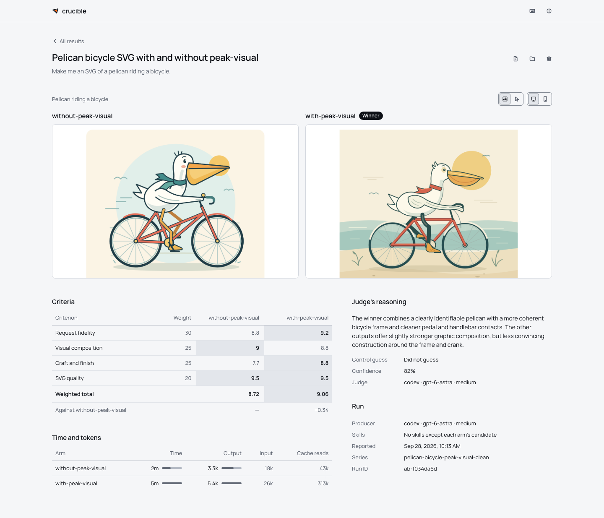

<h1>
  <picture>
    <source media="(prefers-color-scheme: dark)" srcset="brand/logo/lockup-dark.svg">
    
  </picture>
</h1>

Crucible lets your coding agent run blinded A/B tests on your own tasks. Ask it to compare skills, models, prompts, or reference inputs across Claude Code, Codex, and Cursor Agent. It sets up the experiment, monitors the runs, and reports the results; you inspect the outputs side by side with scores, time, and token usage.

Each variation, called an **arm**, works on a separate copy of your project. An independent judge scores anonymous outputs against your rubric before Crucible reveals which arm made each one. You can also skip the judge and inspect the results yourself.



## Ask your agent

Give your agent the [Crucible skill](skills/crucible/SKILL.md), then describe what you want to learn:

> Test whether my writing skill improves this draft. Use the same model and prompt with and without the skill, and show me both outputs with their time and token usage.

> Have Claude, Codex, and Cursor each generate two SVG icons from this brief. Keep the task tiny and skip the judge; I want to compare them myself.

> Test this task with and without the reference picture. Repeat each condition three times.

Your agent writes the experiment and scoring rubric, runs Crucible, checks progress and failures, and brings back the report. The agents being tested receive separate copies of the project and assigned context. A separate judge scores the outputs without seeing their arm labels. You can ask your agent to open the dashboard at any point to inspect the work yourself.

For a first run, ask it to use `examples/first-test/experiment.yaml`, a small coffee-cup SVG test. One run is only one sample; ask for repeated runs when the decision matters.

## What you can test

- A skill against no skill, or two versions of the same skill.
- Different agents, models, effort levels, prompts, or tasks.
- A reference picture or other input given to only some arms.
- Clean environments against your usual skills and subagents.
- Tool setups, including hooks, MCP servers, and setup commands.

Tests can produce Markdown, SVGs, web pages, slide decks, or interactive 3D scenes. The local dashboard shows saved captures and lets you open portable outputs live. Every run saves a report and per-arm time and native token counts; these are not normalized billing estimates.

## Requirements

- An Apple silicon Mac running macOS 26 or newer, Node 24+, and the [Apple Container runtime](https://github.com/apple/container) installed and started.
- Python 3.12+ for Harbor. The setup script installs its pinned dependencies into a dedicated virtual environment.
- A login for each provider you use. The Linux image contains the agent CLIs; host CLIs remain useful for signing in and refreshing your login. [CREDENTIALS.md](CREDENTIALS.md) covers authentication.

If `container system start` asks for a kernel, run `container system kernel set --recommended` and start it again.

Tasks run on Linux. macOS applications, host executables, and host `node_modules` cannot be used inside a guest; install Linux dependencies with `producer.setup` or the runtime image.

## Install

Ask your agent to follow these steps and link the skill below, or run them yourself. Crucible is installed from source:

```sh
git clone https://github.com/chaseleantj/crucible.git
cd crucible
npm ci
brew install container   # if Apple Container is not installed yet
container system start
npm run setup:runtime    # install pinned Harbor and build the Linux agent image
npm run setup:browsers   # host Chromium for unjudged captures and dashboard tests
npm run build
npm link                 # puts `crucible` on your PATH
crucible doctor          # check runtime prerequisites and provider logins
```

## Connect your agent

The [Crucible skill](skills/crucible/SKILL.md) teaches your agent how to configure, run, monitor, and report on experiments. From the Crucible checkout, create the skills folder and link the skill for the agent you use to manage tests:

```sh
# Claude Code
mkdir -p ~/.claude/skills
ln -s "$PWD/skills/crucible" ~/.claude/skills/crucible

# Codex
mkdir -p ~/.codex/skills
ln -s "$PWD/skills/crucible" ~/.codex/skills/crucible

# Cursor Agent
mkdir -p ~/.cursor/skills
ln -s "$PWD/skills/crucible" ~/.cursor/skills/crucible
```

Install the skill for whichever agent manages the experiment; it can test any mix of the three supported agents.

Arms get a copy of your skills folder by default, so keep this skill away from them: add `crucible` to `skills.exclude` in your config (below). Otherwise an agent under test could read about the experiment it is in.

## Configuration

Crucible works without a config file. By default, arms start with the skills in `~/.claude/skills` and finished results are saved to `~/.crucible/archive`. To change that, or to withhold skills from every arm, create `~/.config/crucible/config.yaml`:

```yaml
skills:
  root: ~/.claude/skills          # the skills every arm starts with, unless it runs clean
  exclude: [crucible]             # skills no arm receives
archiveRoot: ~/.crucible/archive  # where finished results are saved
```

`crucible config` prints every setting and where it came from.

## Use the CLI directly

The same workflow is available manually:

```sh
crucible run examples/first-test/experiment.yaml
crucible status <run-id> --watch
crucible ui
```

The example compares Claude Code at low and high effort. Change `producer.agent` or `judge.agent` to use Codex or Cursor; each selected provider needs a login. `run` prints the run ID early, then saves the report and archives the outputs when it finishes.

For a custom test, run `crucible init my-test.yaml`, edit the experiment, and write its Markdown rubric. See the [experiment reference](docs/experiments.md) for prompts, inputs, skills, environment variants, and resource settings. Set `judge: none` to compare outputs without scores; Crucible automatically captures static HTML, SVG, and Markdown. Apps that need a build or server need additional setup. Use a shared `series` name for repeated runs and `crucible series <name>` to tally them.

## Runtime and isolation

| Setting | Default |
| --- | --- |
| Arms per experiment | 1–10 |
| Active VMs | 2, shared across Crucible processes |
| Resources per VM | 2 CPUs, 4 GiB RAM |
| Agent timeouts | 120 minutes per producer; 30 minutes for the judge |

A ten-arm test queues the remaining arms without starting extra VMs. Set resources in the experiment YAML; for tiny writing or SVG tasks, this configuration passed our [live smoke tests](docs/validation/harbor-stress-2026-09-27.md):

```yaml
runtime:
  concurrency: 2
  cpus: 1
  memoryMb: 2048
```

Each producer and judge runs in a disposable Linux VM. No host home, project checkout, or other arm is mounted. Native automatic permission review is enabled for all three agents; Codex also uses its Linux workspace sandbox. Provider credentials stay in a host broker. Guests retain public network access and can spend model budget, so only give them data you are willing to send to those services.

See [runtime and isolation](docs/runtime.md) for concurrency rules, permission modes, credential boundaries, and migration from older experiments.

## More documentation

- [docs/experiments.md](docs/experiments.md): every field in the experiment file.
- [docs/runtime.md](docs/runtime.md): VM resources, isolation, and permission review.
- [docs/commands.md](docs/commands.md): every command, the files a run writes, and the archive format.
- [CONTRIBUTING.md](CONTRIBUTING.md): building and testing Crucible itself.
- [CHANGELOG.md](CHANGELOG.md)

## License

MIT. See [LICENSE](LICENSE).
